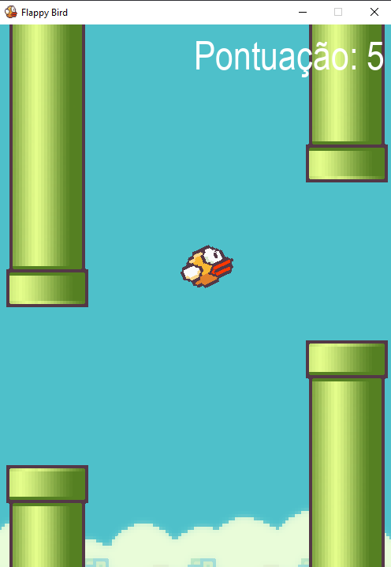

# FlappyBird
 Um clone do Flappy Bird feito em python-pygame
## Configuração
1. Instale o Python 3.10 (recomendado)
1. Instalar virtualenv
1. _Optional_: Instale as bibliotecas PyGame, Os, Random
1. Clone o repositório:

   ```bash
   $ git clone https://github.com/rafaelmachadobr/FlappyBird-Python
   ```
   ou baixe como zip e extraia.
 1. Execute o arquivo FlappyBird.py
 1. Use a tecla <kbd>&uarr;</kbd> ou <kbd>Space</kbd> para jogar e <kbd>R</kbd> para reiniciar o jogo.
 # Screenshot do jogo
 
 
